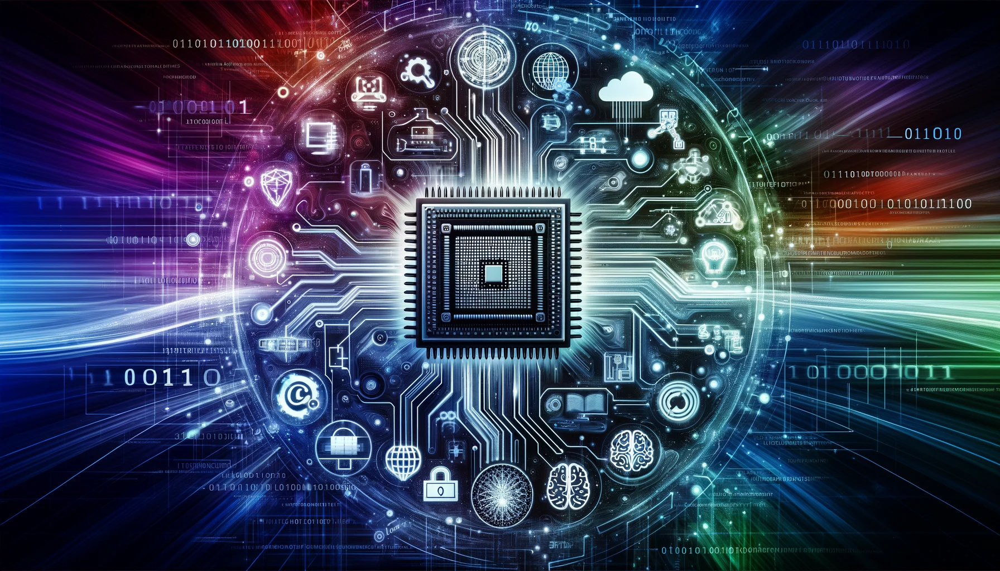

+++
archetype = "chapter"
title = "Introduction à l'informatique"
weight = 1
+++

L'informatique est le domaine d'étude, de recherche et de pratique qui concerne le **traitement de l'information**. Elle englobe plusieurs domaines spécialisés, chacun ayant un focus spécifique. Voici quelques-uns de ces domaines :

1. **Théorie de l'Informatique :** Explore les aspects mathématiques et fondamentaux du calcul et de l'information. Cela inclut la théorie des algorithmes, la théorie de la complexité, la théorie des langages de programmation, et la théorie des automates.

2. **Programmation et Développement de Logiciels** : Se concentre sur la conception, l'écriture, le test, et la maintenance de programmes informatiques. Cela comprend notamment la programmation de systèmes, la programmation orientée objet, et le développement web et mobile.

3. **Systèmes Informatiques et Réseaux** : Couvre la conception, l'implémentation et la gestion des systèmes informatiques et des réseaux de communication. Cela inclut les réseaux de données, la sécurité des réseaux, les systèmes d'exploitation, et la cloud computing.

4. **Intelligence Artificielle et Machine Learning** : Englobe l'étude des algorithmes qui permettent aux ordinateurs de réaliser des tâches qui nécessiteraient normalement l'intelligence humaine. Cela inclut l'apprentissage automatique, la vision par ordinateur, le traitement du langage naturel, et la robotique.

5. **Base de Données et Data Science** : Englobe la conception, la mise en œuvre et l'optimisation des bases de données, ainsi que l'analyse de grandes quantités de données pour en extraire des connaissances et informations. Cela inclut la modélisation des données, le stockage et la récupération de l'information, et l'analyse de données.

6. **Cybersécurité** : Se concentre sur la protection des systèmes informatiques contre les intrusions, le vol d'informations, et les dommages. Cela inclut la cryptographie, la sécurité des réseaux, la sécurité des applications, et la cyberdéfense.

8. **Interaction Homme-Machine** : Étudie la conception et l'utilisation des interfaces informatiques pour améliorer l'interaction entre les humains et les ordinateurs.

{}
L'informatique ne se limite pas au développement de logiciels et à la programmation ; elle englobe une vaste gamme de sujets théoriques et pratiques liés à la manière dont les données et les instructions sont traitées, stockées, communiquées et sécurisées. Elle joue un rôle crucial dans la propulsion des innovations technologiques et a des applications dans presque tous les aspects de la société moderne.
{}

{}
