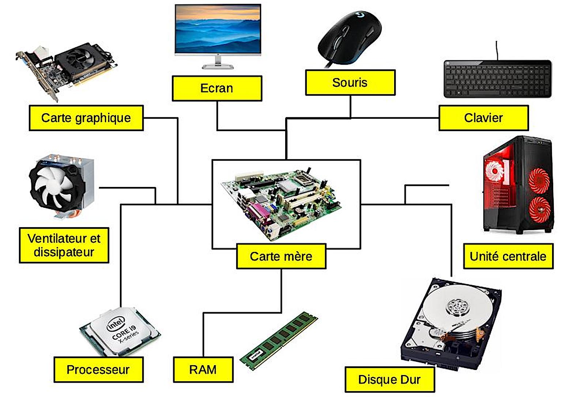

+++
title = "Les composants d'un ordinateur"
+++

Les différents composants d'un ordinateur sont :

1. **Unité centrale de traitement (CPU)** : Le cerveau de l'ordinateur, responsable du traitement des instructions.

2. **Mémoire vive (RAM)** : Mémoire temporaire utilisée pour stocker les données en cours de traitement.

3. **Disque dur ou SSD** : Utilisé pour le stockage permanent de données et de programmes.

4. **Carte mère** : Le composant principal qui relie tous les autres composants de l'ordinateur.

5. **Carte graphique** : Gère le rendu des images, des vidéos et des animations.

6. **Alimentation électrique** : Fournit l'électricité nécessaire à tous les composants de l'ordinateur.

7. **Boîtier** : Contient et protège les composants matériels de l'ordinateur.

8. **Lecteurs de disques optiques** (comme les lecteurs de DVD ou de Blu-ray) : Utilisés pour lire et écrire des données sur des supports optiques.

9. **Ports d'entrée/sortie** : Permettent la connexion à divers périphériques (USB, HDMI, etc.).

10. **Système de refroidissement** : Composé de ventilateurs et parfois de systèmes de refroidissement liquide pour maintenir une température optimale.

11. **Réseau** : Carte réseau ou adaptateur pour la connexion Internet filaire ou sans fil.

Ces composants peuvent varier légèrement selon qu'il s'agisse d'un ordinateur de bureau, d'un ordinateur portable ou d'un serveur, mais ce sont les éléments de base que l'on retrouve dans la plupart des ordinateurs.