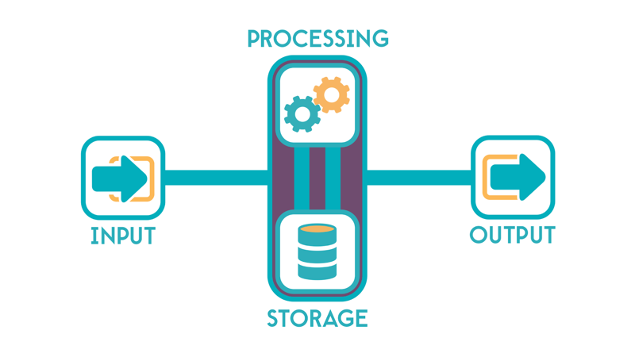

+++
title = "Qu'est-ce qu'un ordinateur ?"
weight = 1
+++

Un ordinateur est une machine électronique conçue pour traiter et stocker des données, et exécuter des séquences d'instructions appelées programmes. Ces programmes permettent à l'ordinateur de réaliser une grande variété de tâches, allant du traitement de texte simple à des calculs complexes et à la gestion de vastes bases de données.

Les ordinateurs fonctionnent en suivant des algorithmes, qui sont des ensembles d'instructions pour résoudre un problème ou accomplir une tâche. Voici les principaux éléments d'un ordinateur :

1. **Unité centrale de traitement (CPU) :** C'est le cerveau de l'ordinateur, où les instructions des logiciels sont exécutées et les données sont traitées.

2. **Mémoire :** Les ordinateurs utilisent divers types de mémoire pour stocker temporairement et de manière permanente les données et les programmes. La mémoire vive (RAM) est utilisée pour le stockage temporaire et rapide, tandis que les disques durs ou les SSD (Solid State Drives) sont utilisés pour le stockage à long terme.

3. **Périphériques d'entrée :** Ce sont des appareils comme le clavier et la souris qui permettent à l'utilisateur d'entrer des données et des commandes dans l'ordinateur.

4. **Périphériques de sortie :** Ces appareils, comme l'écran et l'imprimante, permettent de présenter les résultats du traitement des données par l'ordinateur.

Les ordinateurs varient en taille et en capacité, allant des superordinateurs puissants utilisés pour des calculs complexes à des ordinateurs personnels de bureau ou portables, jusqu'aux téléphones intelligents et autres appareils portables. Ils sont utilisés dans presque tous les domaines de la vie moderne, comme l'éducation, la médecine, l'industrie, le divertissement et bien plus encore.